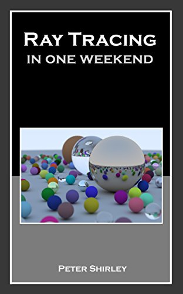

---
# Feel free to add content and custom Front Matter to this file.
# To modify the layout, see https://jekyllrb.com/docs/themes/#overriding-theme-defaults

layout: page
permalink: /
---

{:class="img-responsive" style="display:block; margin:auto" width="800px"}

## Overview ##

Production Computer Graphics is about the techniques and technologies used to generate high quality synthetic digital imagery. The main focus of the course will be 3D photorealistic physically-based rendering methods currently used in cinematic rendering and games.

The course is project-oriented and over the course of the semester you will implement your own rendering engine capable of generating high quality images. You get to design the scenes you render and choose the advanced rendering effects you wish implement...whether that is procedural generation of another world or animation or using hardware acceleration for real-time ray tracing...or something else.

The focus of the course will be on learning things you wish to learn. For example, you can choose any programming language you wish for the assignments. If you want to learn Rust or another new language, this is an opportunity to do so. There will be a few low-stakes quizzes and two exams, but these really exist just to encourage people to keep pace with the course. The majority of your grade will be based on your creative work.   

This semester, we anticipate having live guest lectures from University of Illinois graduates currently working at NVIDIA, Pixar, and Blizzard. You will have the opportunity to ask people about their work and what their advice is for pursuing work in industry.

### Topics
The topics we will cover include:

+ Basic ray tracing 
+ Path tracing
+ Photon mapping
+ Real-time ray-tracing
+ Volumetric rendering of effects like fog and smoke
+ Fluid simulation
+ Digital material modeling
+ Geometric data structures
+ High dynamic range imaging
+ Procedural texture generation
+ Procedural geometry generation
+ Compositing
+ Geometric modeling
+ Radiosity
+ Radiometry

#### Prerequisites ####
We recommend the following courses and skills:

- [CS 225](https://courses.engr.illinois.edu/cs225/){:target="_blank" rel="noopener"} - prior general programming experience
- [Math 415](https://math.illinois.edu/resources/department-resources/syllabus-math-415){:target="_blank" rel="noopener"} - basic linear algebra, especially 3D transforms

## Instructional Content ##

The course will be taught using online lectures along with additional reading materials

#### Lectures ####

+ Lectures will be available as asynchronous video links posted on the [course schedule](https://illinois-cs419.github.io/schedule).
+ **You can attend live lectures/discussions at 11am Central Time on Tuesdays at this [Zoom link](https://illinois.zoom.us/j/81558731281?pwd=UE1XUGFlVEUxOVp1cVhWNFNhVXJJdz09).**
+ These lectures will be recorded and available on the course schedule.
+ We know attending online synchronous lectures can be difficult, so there is no required attendance.

#### Reading ####

The course will use Pete Shirley's free online books: 

    

    

    

There will be additional course notes ans assigned reading form other sources.

## Assessments ##

Assigned work will include 4 quizzes, 3 programming assignments, 2 exams and a final project completed as a team.

#### Tri-Weekly Quizes ####
There will be 4 short quizzes on PrairieLearn. These quizzes will be based on the lecture material and will serve as practice for the exams
**Each quiz can be taken repeatedly..you can retake it till you get all the questions correct**

+ **They are due at midnight 7 days after they are assigned.**
+ They can be completed late for 50% credit at any time before May 5.

#### Programming Assignments ####
There will a series of 3 programming assignments. These can be done in any programming language you wish. They will provide you with a basic understanding of physically-based rendering and can be used as a code base for the course project

#### Project ####
The course project will be team-based with teams of 3 to 4 people working on a project. You will have a choice of what to implement. Typically, a group will add advanced features to your existing code. For example, you could add animation and physics or volumtric rendering of smoke and other participating media. 

#### Exams ####
This class will have two midterm exams and no final exam. Each exam is on the PrairieLearn platform. 

- Exam 1: Week of March 8-12
- Exam 2: Week of May 6-14

The exams will be asynchronous and can be taken any time during the week assigned. They are time-limited, so once you start you will have 60 minutes to finish. They are open web - you can use any reference material you wish while taking the exam. You should not collaborate with other people. Any instances of collaboration will be considered a violation of academic integrity and will result in a 0 on the exam and a letter grade reduction in the final course grade. Also, the nature of the exam will make collaboration unhelpful - you will get a better grade working on your own rather than wasting time trying to work together. 

A second-chance exam will be offered the week after which will not be identical to the first exam but will cover the same topics. If taken, this exam will be for a maximum of 80% credit and can be used to replace the original exam score.

## Grades ##
We will post grades on [Compass 2g](https://compass.illinois.edu){:target="_blank" rel="noopener"}.

We weight grades as follows:

| | 3 credits | 4 credits |  
| ----- | ------ | ----- |  
| MP 1 | 5% | 5% | 
| MP 2 | 10% | 10% | 
| MP 3 | 10% | 10% |  
| Quizzes| 5%  | 5%  |
| Exam 1| 15% | 15% |
| Exam 2| 15% | 15% |
| Project | 40% | 30% |
| 4 Credit Project | NA | 10% |

The course grade cutoffs can be expected to be:

|Percentage lower bound | Grade |  
| ----- | ------ | 
| 98%| A+ |
| 93% | A |  
| 90% | A- |  
| 87% | B+ |  
| 83% | B |  
| 80% | B- |  
| 77% | C+ |  
| 73% | C |  
| 70% | C- | 
| 67% | D+ |  
| 63% | D |  
| 60% | D- |  
| 0%  | F  |

## Communication ##

#### [CampusWire](https://campuswire.com/p/GECC31C03) ####
We will use CampusWire for answering questions and administering the course.
Click the header to join/view the forum.  
Use the passcode 3796.

+ For any question involving a grade you should select `Post to instructors and TAs`.

#### Course Staff ####

* Professor Eric Shaffer, shaffer1@illinois.edu
* TA Jack Danner

#### Mental Health ####
Diminished mental health, including significant stress, mood changes, excessive worry, substance/alcohol abuse, or problems with eating and/or sleeping can interfere with optimal academic performance, social development, and emotional wellbeing. The University of Illinois offers a variety of confidential services including individual and group counseling, crisis intervention, psychiatric services, and specialized screenings at no additional cost. If you or someone you know experiences any of the above mental health concerns, it is strongly encouraged to contact or visit any of the University’s resources provided below. Getting help is a smart and courageous thing to do -- for yourself and for those who care about you.

Counseling Center: 217-333-3704, 610 East John Street Champaign, IL 61820
McKinley Health Center:217-333-2700, 1109 South Lincoln Avenue, Urbana, Illinois 61801

